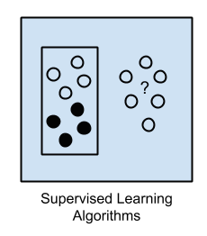
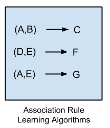
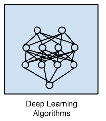
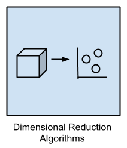

# Introduction

摘录自http://machinelearningmastery.com/a-tour-of-machine-learning-algorithms/

## 监督学习、无监督学习、半监督

## overview

## Regression

## Instance-based 
winner-take-all methods and memory-based learning

## Regularization 

## Decision Tree

## Bayesian 

## Clustering

## Association Rule Learning
找出feature之间的关系

## Artificial Neural Network

## Deep Learning

## Dimensionality Reduction

## Ensemble

## 其他

* Feature selection algorithms
* Algorithm accuracy evaluation
* Performance measures