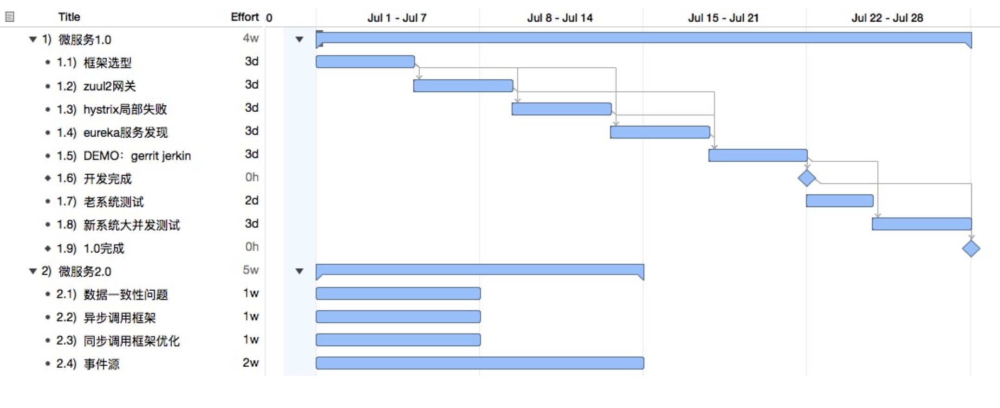

# 微服务实践：0-1

> 

               \
               _\,,
              "-=\~     _
                 \\~___( ~
                _|/---\\_
        steven  \        \    阶形后端基础架构 2018.07

## WHY

#### 为什么要用微服务

相对于单体应用而言随着规模增大，将面临如下问题：

* 难以维护
* 部署困难
* 降低开发速度
* 性能扩展困难
* 可靠性差
* 不能完全预见修改的影响，需要大量测试

#### 优点：

* 微服务解决复杂性问题，以模块化形式便于理解、开发和维护。
* 每个服务可以使用自己的框架或语言。
* 独立部署，不影响其他服务，加快部署速度
* 独立扩展硬件性能

#### 组织管理形式

> 微服务是在业务超过一定复杂度，以及团队规模达到一定人数后，一套开发管理和软件架构方案

#### 不足 there are no silver bullets：

* 面临局部失效问题	
* 相对于单体应用需要更复杂的架构支持
* *分区的数据库架构*
* 更加复杂的测试
* 对于某项服务的改变可能波及其他服务
* 需要大量配置、部署、扩展和监控的支持

## WHAT

#### Scale Cube
来自《The Art of Scalability》 一书

Y扩展

X扩展

#### 微服务架构

每个微服务有自己独立的数据库

##### API Gateway 

负责负载，均衡、缓存、访问控制、API 计费、监控

客户端与服务直接通信

* 在公网上发送许多请求，可能很低效。
* 增加客户端复杂性。
* 服务重构将影响客户端。

优点：封装了应用程序的内部结构
缺点：增加了一个必须开发、部署和维护的高可用组件。网关变成了开发瓶颈

> 定制的API，需要处理局部失败问题，依赖服务发现组件
    
##### 服务发现

etcd、consul、Apache ZooKeeper

## HOW

#### roadmap

* 第一阶段以Spring Cloud为基础，对微服务框架进行系统搭建和实验
* 第二阶段在前面基础之上，对新项目采用微服务框架进行开发和项目管理，在此过程中需要逐步解决微服务本身面临的架构问题
* 第三阶对微服务进行全面监控和其他工程化管理
* 第四阶段将原有老系统依据优先级进行局部微服务化【optional】

#### 实施计划

## More：1-2
#### 服务监控
#### 调用链
#### 容器化
#### 自动部署

