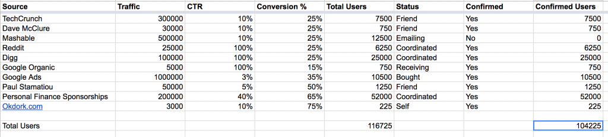
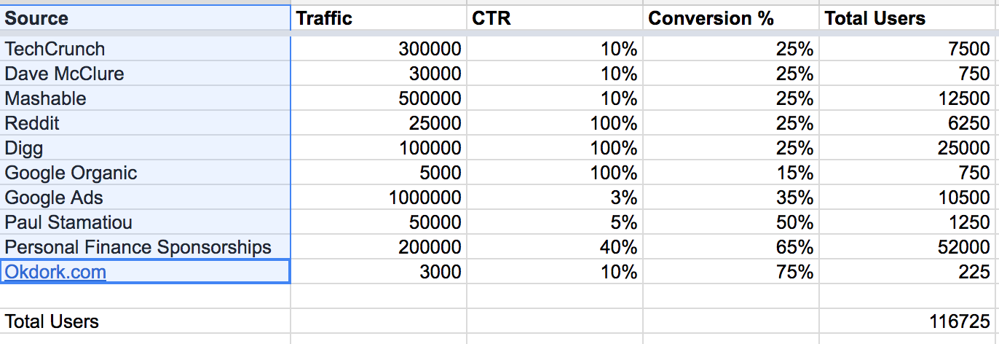
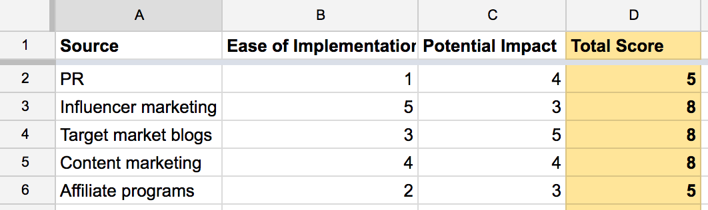
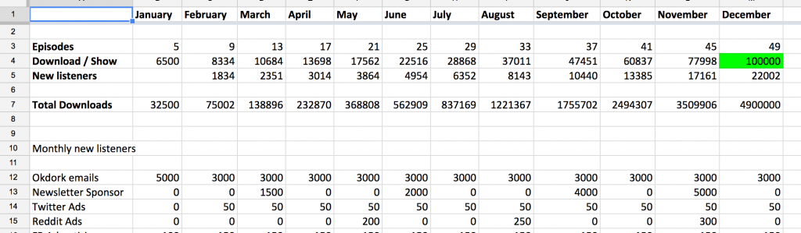

# 关于marketing
http://okdork.com/quant-based-marketing-for-pre-launch-start-ups/?utm_source=wanqu.co&utm_campaign=Wanqu+Daily&utm_medium=website

> 好产品，让市场工作变成教育目标顾客和好的传播而不是一味的销售。当然无人知晓好产品也是不行的。
    
> 增长策略：从目标逆向工程，而不是搜索 ‘social media marketing’ or ‘growth hacking,'

#### 1.设定可量化的目标
就像开车是事先有目的地。

#### 2.时间表
多少时间内，达到XX目标

#### 3.制定计划

> 
Source: Where are these users coming from? This source could be a blog you’re aiming for coverage on, Facebook Ads, Google AdWords, or any marketing channel推广途径    
Traffic: How much traffic does this channel receive? Or for an ad on Facebook or AdWords, how many impressions will you make? Use your BEST GUESS. The point here is to help you prioritize the different marketing channels多少展示机会    
CTR (Click-through rate): How much of that traffic will click through from the source to your website?从展示区域到网站    
Conversion %: Of those who click-through to your site, what percentage of those will convert to sign ups?转化率，来到网站的有多少注册了    
Users: How many users will this channel bring you? These are people who complete your signup process and use your product (this is your best estimate based on the numbers in the previous columns)注册的用户多少使用了产品    
Status: Where are you with this source? Is it all ready to go? Have you sent the first inquiry about the setup? Keep track of the status of each source in this column每个推广渠道当前的更进状态    
Confirmed: Is this happening? Yes or No渠道是否执行，是否有效    
Confirmed users: How many users did this source bring you? Confirmed users is the most critical column in the sheet. This number shows you how many users you generated from this source. Then you can re-prioritize your marketing efforts moving forward based on the results确切的用户数量    

#### 4.研究优化重点的推广渠道

###### 谁是你的顾客
> 
PR: Pitching the press and bloggers in your niche to cover your story公关向媒体介绍你的故事    
SEM (Search engine marketing): Paid ads on search engines like Bing and Google, so your name will appear when certain keywords are searched搜索关键词    
SEO (Search engine optimization): Optimizing your blog posts, landing pages and site to rank well in search engines for keywords related to your business
Social and display ads: Targeting your audience through ads on social channels like Twitter and Facebook社交媒体    
Content marketing: Creating and publishing content (blogs, podcast, video) with the goal of generating interest in your product/service内容营销    
Direct sales: Directly speaking to potential customers. This could mean picking up the phone and calling potential customers or sending cold emails to prospects向潜在顾客直接推销    
Target market blogs: Sponsor posts and content on popular blogs within your target market向目标顾客关注的blog投放内容    
Influencer marketing: Identify and build relationships with individuals who have influence over your target market (e.g. high profile bloggers or Instagrammers)与目标客户的意见领袖建立关系

以上有助于对渠道进行优先级排序（评分标准：易于执行，潜在影响力）    
最少10个渠道，最好15个    
关键点是定位理想的目标顾客    

注意预算和时间表

#### 5.每个渠道设定目标
有量化的目标才能知道哪些有效，哪些需要调整
流量估计 SimilarWeb(https://www.similarweb.com/) or SEMRush(https://www.semrush.com/).
学习别人的案例用于估计某个渠道的CTR和Conversion%，广告平台可以参考WordStream(http://www.wordstream.com/average-ctr)

#### 6.根据目标建立timeline

在总时间表里面划分每个阶段每个渠道的目标。流量来源需要是确认的。

#### 7.跟踪进度
促进有效的，砍掉无效渠道。前期会有些实验，直到知道哪些是有效的
